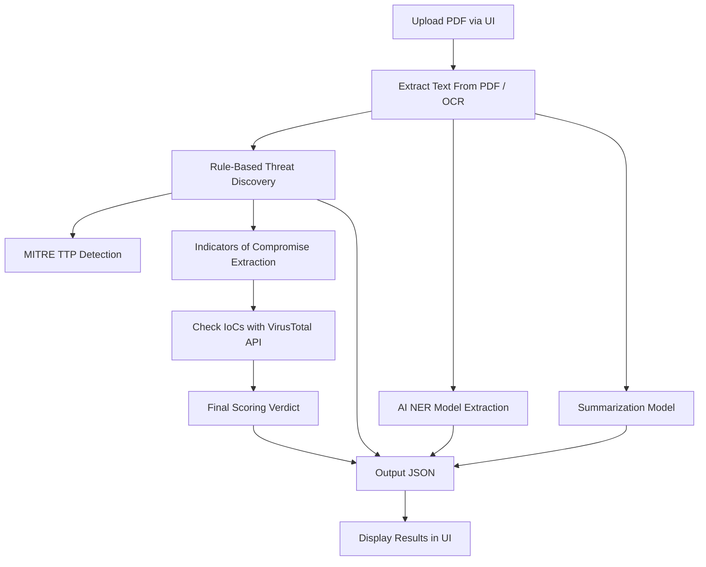

# 🛡 Cyber Threat Intelligence Analyzer
AI-Powered Automated Threat Intelligence from Cybersecurity PDF Reports  
Extract IoCs, TTPs, Threat Actors, Malware signatures, run VirusTotal analysis & generate summaries.

---


---

# 🛡 Cyber Threat Intelligence Analyzer
AI-Powered Automated Threat Intelligence from Cybersecurity PDF Reports  
Extract IoCs, TTPs, Threat Actors, Malware signatures, run VirusTotal analysis & generate summaries.

---


---

## 🚀 System Architecture Diagram


### 🧪 Sample Output JSON
```json
{
  "Final Verdict": "Malicious",
  "IoCs": {
    "IP addresses": ["192.168.1.1"],
    "Domains": ["example.com"]
  },
  "TTPs": {
    "Tactics": [
      { "TA0001": "Initial Access" }
    ],
    "Techniques": [
      { "T1566.001": "Spear Phishing Attachment" }
    ]
  },
  "Threat Actor(s)": ["APT33"],
  "VirusTotal Results": {
    "Hashes": {
      "abc123": {
        "score": 31,
        "malware_name": "Hacktool.PDF.Phish.3!c"
      }
    }
  }
}
```

###📁 **cyber-threat-intelligence-analyzer**

```bash
│── `app.py`                    # Streamlit UI
│── `main.py`                   # Backend pipeline
│── `requirements.txt`
│── `README.md`
│
├── **src/**
│   ├── `extracter.py`          # Text → IoC, TTP, Threat Actor extraction
│   └── `vt_api.py`             # VirusTotal API integration
│
├── **data/**
│   ├── `reports/`              # Uploaded PDFs
│   └── `output/`               # Result JSON files
│
├── **config/**
│   └── `config.json`           # API Keys (ignored in Git)
│
├── `.gitignore`
└── `.env`
```


